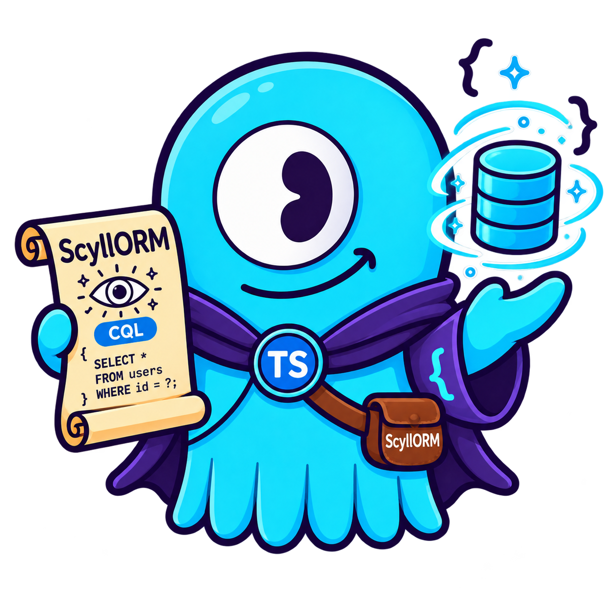

# Scyllorm - Typescript ORM for ScyllaDB
[](https://www.npmjs.com/package/scyllorm)
[](https://www.npmjs.com/package/scyllorm)
[](https://github.com/tfmf/scyllorm/actions/workflows/ci.yml)
[](https://github.com/tfmf/scyllorm/blob/main/LICENSE)

<p align="left">
  
</p>


Welcome to **Scyllorm**—an experimental TypeScript ORM for ScyllaDB that’s so fresh, it’s practically still in beta diapers. Inspired by [TypeORM](https://github.com/typeorm/typeorm), we’ve set out to simplify database interactions in Node.js. By “simplify,” we mean it’s highly opinionated, so prepare to adopt our opinions, or go find another ORM. Features? Yeah, we’ve got some—just not all of them (yet). A few are stuck in the backlog, and others are on Scylla’s “no-can-do” list. 

And by the way, we use the Node.js [Cassandra driver](https://github.com/datastax/nodejs-driver/), so theoretically, you could use this with Cassandra too... but we haven’t tested it. So if you’re feeling adventurous, go ahead and be our guinea pig.

Oh, and we’re currently rolling with the [Data Mapper Pattern](https://en.wikipedia.org/wiki/Data_mapper_pattern) because it’s what all the cool ORMs are doing. Maybe someday we’ll add the [Active Record Pattern](https://en.wikipedia.org/wiki/Active_record_pattern), but we’re still debating whether we like our records active or not.

## Prerequisites 🎒
-  **Node.js:** If you don't have this, you might be in the wrong place.
-  **Docker:** The easiest way to spin up ScyllaDB locally without accidentally summoning Cthulhu.

## Installation 🚀
To install Scyllorm, just hit it with the good ol’ NPM:

```bash
npm install scyllorm
```
(https://www.npmjs.com/package/scyllorm)

## Step-by-Step Guide 🛠
### 1. Summon ScyllaDB via Docker 🐳

**Docker:**

```bash
docker run -d \
  -p 9042:9042 \
  --cpus 2 \
  --memory 2g \
  scylladb/scylla:latest \
  --smp 2 \
  --memory=2G \
  --overprovisioned 1 \
  --authenticator PasswordAuthenticator \
  --authorizer CassandraAuthorizer \
  --max-clustering-key-restrictions-per-query 1500
```

**docker-compose:**

```bash
  core_scylladb:
    container_name: scylladb_server
    image: scylladb/scylla:latest
    ports:
      - "9042:9042" # CQL
    command: --smp 2 --memory=2G --overprovisioned 1 --authenticator PasswordAuthenticator --authorizer CassandraAuthorizer --max-clustering-key-restrictions-per-query 1500
    volumes:
      - ./scylladb_data:/var/lib/scylla
```

### 2. Test Your Connection 🎯
- For a friendly UI, try [DbVisualizer Free](https://www.dbvis.com/).
- Or, if you're feeling hardcore, dive into the terminal:

```bash
docker exec -it scylladb_server cqlsh -u cassandra -p cassandra
```

### 3. Create a Test Table 🛠️
Because what’s a database without a table?

```cql
CREATE KEYSPACE test_keyspace WITH REPLICATION = {'class': 'SimpleStrategy', 'replication_factor': 1} AND durable_writes = true;

USE test_keyspace;

CREATE TABLE employees (
  id int,
  first_name text,
  last_name text,
  age int,
  city text,
  created_at timestamp,
  updated_at timestamp,
  deleted_at timestamp,
  PRIMARY KEY (id, first_name)
);

CREATE INDEX employees_first_first_name_idx ON employees (first_name);
CREATE INDEX employees_first_last_name_idx ON employees (last_name);
```

### 4. Create Your Model 🎨
Now, let’s make a model:

```typescript
import { BaseModel, Column, Entity, Index, PrimaryKeyColumn } from 'scyllorm';

@Entity('employees')
@Index('employees_first_first_name_idx', 'first_name')
@Index('employees_first_last_name_idx', 'last_name')
export class Employee extends BaseModel {
    @PrimaryKeyColumn('INT', { partitionKey: true })
    id: number;

    @PrimaryKeyColumn('TEXT', { clusteringKey: true })
    first_name: string;

    @Column('TEXT')
    last_name: string;

    @Column('INT', { default: 0 })
    age: number;

    @Column('TEXT', { default: 0 })
    city: string;

    @Column('TIMESTAMP', { default: () => new Date() })
    created_at: Date;

    @Column('TIMESTAMP', { default: () => new Date() })
    updated_at: Date;

    @Column('TIMESTAMP')
    deleted_at: Date | null;
}
```

### 5. Setup the DataSource 🛢
This is where the magic happens:

```typescript
import { DataSource } from 'scyllorm';

const dataSource = new DataSource({
    contactPoints: ['localhost'], // Change this if your setup is fancier
    localDataCenter: 'datacenter1',
    keyspace: 'test_keyspace',
    credentials: {
        username: 'cassandra',
        password: 'cassandra',
    },
    protocolOptions: { port: 9042 },
});
```

### 6. Use the Repository 🛠
Now, let’s put this thing to work:

```typescript
 async function run() {
    try {
        await dataSource.initialize();

        const repository = dataSource.getRepository(Employee);

        const employee = new Employee();
        employee.id = 1;
        employee.first_name = 'John';
        employee.last_name = 'Doe';
        employee.age = 30;
        employee.city = 'New York';

        const employee2 = new Employee();
        employee2.id = 2;
        employee2.first_name = 'Jane';
        employee2.last_name = 'Doe';
        employee2.age = 25;
        employee2.city = 'Los Angeles';

        await repository.save(employee);
        console.log('Employee 1 saved successfully!');

        await repository.save(employee2);
        console.log('Employee 2 saved successfully!');

        const employeeId = 1;

        const findOneById = await repository.findOneBy({ id: employeeId });
        console.log('Found by ID:', findOneById);

        const findById = await repository.findBy({ id: employeeId });
        console.log('Found by findBy:', findById);

        const findEmployee = await repository.find({ where: { id: employeeId } });
        console.log('Found by find:', findEmployee);

        const allEmployees = await repository.find();
        console.log('All Employees:', allEmployees);

        const limitedEmployees = await repository.find({ limit: 5 });
        console.log('Limited Employees:', limitedEmployees);

        const orderedEmployees = await repository.find({
            where: { id: employeeId },
            orderBy: { first_name: 'ASC' },
            limit: 10,
        });
        console.log('Ordered Employees:', orderedEmployees);

        // https://www.scylladb.com/2018/08/16/upcoming-enhancements-filtering-implementation/
        const allowFiltering = true;
        const findEmployeeWithAge30And25 = await repository.find({ where: { age: In([25, 30]) } }, allowFiltering);
        console.log('Found Employees with age 30 and 25:', findEmployeeWithAge30And25);

        const findEmployeeWithAgeAbove25 = await repository.find({ where: { age: GreaterThan(25) } }, allowFiltering);
        console.log('Found Employees with age above 25:', findEmployeeWithAgeAbove25);

        const findEmployeeWithAgeAboveOrEqualTo25 = await repository.find(
            { where: { age: GreaterThanOrEqual(25) } },
            allowFiltering
        );
        console.log('Found Employees with age equal to 25 or above:', findEmployeeWithAgeAboveOrEqualTo25);

        const findEmployeeWithAgeLessThan30 = await repository.find({ where: { age: LessThan(30) } }, allowFiltering);
        console.log('Found Employees with age less than 30:', findEmployeeWithAgeLessThan30);

        const findEmployeeWithAgeLessThanOrEqual30 = await repository.find(
            { where: { age: LessThanOrEqual(30) } },
            allowFiltering
        );
        console.log(findEmployeeWithAgeLessThanOrEqual30);

        const findEmployeeWithRawQuery = await repository.runRawQuery(
            `SELECT * FROM employees WHERE id = :employee_id`,
            { employee_id: 1 }
        );
        console.log(findEmployeeWithRawQuery);
    } catch (error) {
        console.error('Error:', error);
    } finally {
        await dataSource.shutdown(); // Don’t forget to shut it down, or it might haunt you later.
    }
}
run();
```

### 7. Handle Large Result Sets 📄

ScyllaDB returns results one page at a time (5000 rows by default). `find()`
reads every page for you, so it always returns the complete result set — but for
a big table that means holding all of it in memory. When a query can match a lot
of rows, reach for one of these instead.

**Cursor-based pagination** — read one page at a time and hand the cursor back to
your caller (an HTTP client, say):

```typescript
const firstPage = await repository.findPaged({ fetchSize: 100 });
console.log(firstPage.rows, firstPage.hasMore);

if (firstPage.hasMore) {
    const nextPage = await repository.findPaged({ fetchSize: 100, pageState: firstPage.pageState });
    console.log(nextPage.rows);
}
```

`pageState` is `undefined` on the last page, which is what `hasMore` reflects.

**Streaming** — iterate row by row, fetching pages lazily, so only a single page
is ever in memory. This is the way to scan a table larger than your process:

```typescript
for await (const employee of repository.stream({ where: { city: 'New York' } }, true)) {
    console.log(employee.first_name);
}
```

Both accept the same options as `find()` — `where`, `orderBy`, `limit` and the
`allowFiltering` flag — plus `fetchSize` to control the page size.

### 8. Raw CQL, When the ORM Is in the Way 🔓

Column names in `where`, `orderBy` and `delete` are checked against your entity —
CQL cannot parameterize an identifier, so anything not declared with `@Column()`
is rejected instead of concatenated. That rules out a few legitimate idioms:
`token(id)` ranges, quoted identifiers, collection access like `metadata['key']`,
functions and aggregates. `runRawQuery()` is the escape hatch for all of them:

```typescript
const rows = await repository.runRawQuery(`SELECT * FROM employees WHERE id = :employee_id`, { employee_id: 1 });
```

Values are bound, never concatenated — every `:name` becomes a `?`, and colons
inside string literals, quoted identifiers and comments are left alone. The query
string itself is sent as written, so **never build it from user input**; that is
exactly the injection the rest of the API prevents.

Rows are mapped onto the entity by default. For anything the entity cannot
represent — an aggregate, a projection, another table — pass `raw: true` and the
driver's rows come back untouched:

```typescript
const [{ count }] = await repository.runRawQuery<{ count: number }>(
    `SELECT COUNT(*) AS count FROM employees WHERE city = :city`,
    { city: 'New York' },
    { raw: true, allowFiltering: true }
);
```

`runRawQuery()` reads the whole result set into memory. For a large scan — which
is what a `token()` range is usually for — the paging pair from §7 has raw
counterparts taking the same options plus `fetchSize` and `pageState`:

```typescript
for await (const employee of repository.streamRawQuery(
    `SELECT * FROM employees WHERE token(id) > token(:after)`,
    { after: 1 },
    { fetchSize: 500 }
)) {
    console.log(employee.first_name);
}

const page = await repository.runRawQueryPaged(`SELECT * FROM employees`, {}, { fetchSize: 100 });
console.log(page.rows, page.hasMore, page.pageState);
```

A missing `:name` throws `InvalidQueryError` before anything is sent; a query the
server rejects throws `QueryFailedError`, with the driver's own error on `.cause`
and the CQL on `.query`.

### 9. Error Handling ⚠️

Every error Scyllorm raises extends `ScyllormError`, so `instanceof ScyllormError`
catches all of them — switch on `.code` rather than the message, since codes are
stable and messages are not.

```typescript
import { ScyllormError, UnknownColumnError, InvalidQueryError, QueryFailedError } from 'scyllorm';

try {
    await repository.find({ where: { nope: 1 } });
} catch (error) {
    if (error instanceof UnknownColumnError) {
        // A column not declared on the entity was used in a query — CQL can't
        // parameterize identifiers, so unknown ones are rejected, not escaped.
        console.error(error.column, error.entity, error.knownColumns);
    } else if (error instanceof InvalidQueryError) {
        // The query was malformed before it was ever sent to the server.
    } else if (error instanceof QueryFailedError) {
        // The server rejected the query; the driver's error is on error.cause.
    } else if (error instanceof ScyllormError) {
        // Any other Scyllorm-raised error.
    }
}
```

### Supported Column Types
Scyllorm supports the following CQL column types:

`ASCII` · `BIGINT` · `BLOB` · `BOOLEAN` · `COUNTER` · `DATE` · `DECIMAL` · `DOUBLE` · `DURATION` · `FLOAT` · `FROZEN` · `INET` · `INT` · `LIST` · `MAP` · `SET` · `SMALLINT` · `TINYINT` · `TIME` · `TIMESTAMP` · `TIMEUUID` · `TEXT` · `TUPLE` · `UUID` · `VARINT` · `VARCHAR`

And that’s it! If you followed along and didn’t encounter any errors, you’re officially ready to start messing with ScyllaDB using TypeScript in Node.js. Congratulations! 🎉🌊🦑💻

## Contributing
Found a bug? Want to add a feature?  We welcome all contributions! Just open a PR and we'll review it as fas as humanly possible (or not)

## Examples
You can find examples in Typescript and Javascript inside the folder [src/examples](https://github.com/tfmf/scyllorm/tree/main/src/example)

## License
MIT License


